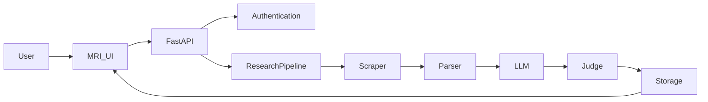
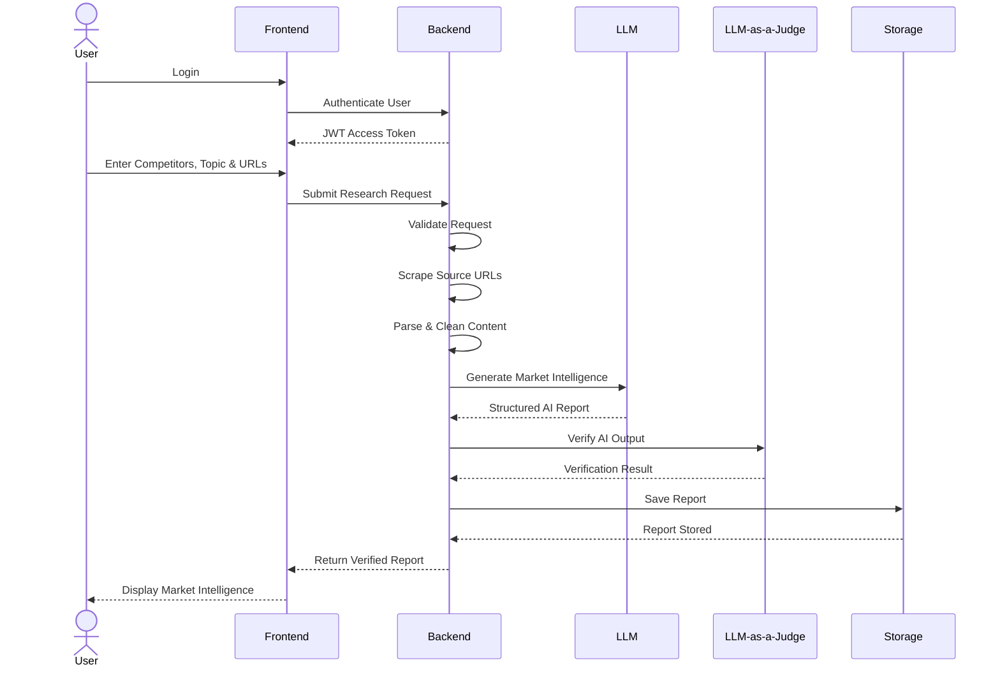

# Market Research Intelligence Assistant

> An AI-powered web application that helps Product, Strategy, and Go-To-Market (GTM) teams gather, analyse, and validate market intelligence from multiple public sources using Large Language Models (LLMs).

---

## Project Overview

Market intelligence is often scattered across blogs, company announcements, news articles, and product pages. Manually collecting and analysing this information is time-consuming and difficult to validate.

The **Market Research Intelligence Assistant (MRI)** automates this process by allowing users to:

- Research competitors and market topics
- Analyse multiple public URLs
- Generate structured AI-powered summaries
- Trace every insight back to its original source
- Verify generated insights using an **LLM-as-a-Judge** approach
- Store previously generated reports for future reference

---

# Live Application

| Component | Link |
|----------|------|
| Frontend | **https://mri-frontend-4opxigsvf-mri-agent.vercel.app/** |
| Backend API | **https://mi-backend-dev-app.agreeablepebble-c7083890.westus2.azurecontainerapps.io** |

---

# Source Code

| Repository | Link |
|------------|------|
| Frontend | https://github.com/chandrika-suddamalla/MRI_frontend |
| Backend | https://github.com/chandrika-suddamalla/MRI_backend |

---

# Features

- User Registration & Login
- JWT Authentication
- Multi-source Market Research
- AI-powered Market Intelligence Reports
- Theme-based Insight Generation
- Competitor Activity Detection
- Source Attribution
- LLM-as-a-Judge Verification
- Report History
- Cloud Deployment
- Infrastructure as Code using Terraform

---

# System Architecture



---

# Application Workflow



---

# Technology Stack

## Frontend

- React
- Vite
- Material UI
- Axios
- React Router

## Backend

- FastAPI
- Python
- Pydantic
- BeautifulSoup
- Requests
- JWT Authentication
- PBKDF2 Password Hashing

## AI

- Groq LLM
- LLM-as-a-Judge

## DevOps

- Docker
- Terraform
- GitHub Actions
- Azure
- Vercel

---

# Repository Structure

```
MRI/

├── MRI_frontend/

└── MRI_backend/
```


---

# AI Pipeline

```text
User Input

↓

URL Collection

↓

Web Scraping

↓

Content Parsing

↓

Prompt Construction

↓

Gemini Analysis

↓

Structured Report

↓

LLM-as-a-Judge

↓

Verified Report

↓

Stored Report
```

---


# Future Improvements

The current implementation focuses on delivering the core assignment requirements while maintaining a modular architecture. The following enhancements could further improve the application:

- **Change Detection:** Automatically compare newly generated reports with previous analyses to highlight new competitor announcements, product launches, pricing changes, or market trends since the last run.

- **Report Comparison:** Allow users to compare multiple reports side by side to identify evolving market trends, competitor strategies, and changes over time.

- **Scheduled Research Jobs:** Enable users to schedule recurring market research (daily, weekly, or monthly), automatically generating updated reports without manual intervention.

- **Email Notifications:** Notify users via email whenever a scheduled report is completed or significant competitor activity is detected.

- **Semantic Search with Vector Database:** Store report embeddings in a vector database to enable semantic search, allowing users to retrieve relevant historical reports using natural language queries.

- **Support for Multiple LLM Providers:** Extend the architecture to support additional AI models such as OpenAI GPT, Anthropic Claude, or Azure OpenAI, giving users flexibility in model selection.

- **Streaming AI Responses:** Stream report generation in real time so users can view insights as they are generated, improving the overall user experience for longer analyses.

- **Multi-language Support:** Enable analysis of sources in multiple languages and generate summaries in the user's preferred language, making the application suitable for global market research.

---

# AI References

## AI Models

- Groq LLM model

## AI Validation

- LLM-as-a-Judge

## Development Assistance

Generative AI tools were used to assist with implementation, debugging, documentation, and code refinement. All generated code and documentation were reviewed, validated, and modified before submission.

---

# Author

**Chandrika Suddamalla**

Software Engineer | Backend Development | AI Applications
