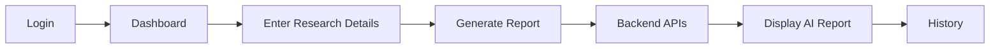
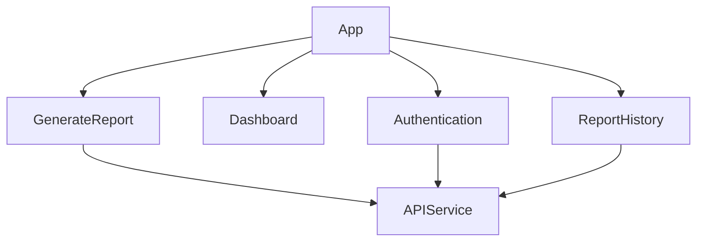

# Market Research Intelligence Assistant – Frontend

The frontend for the **Market Research Intelligence Assistant** provides an intuitive interface that enables Product, Strategy, and Go-To-Market (GTM) teams to collect, analyse, and summarize market intelligence from multiple public sources using AI.

The application allows authenticated users to submit competitors, research topics, and source URLs, generate structured market intelligence reports, and review previously generated reports.

---

# Table of Contents

- Problem Statement
- Solution Overview
- Features
- Application Workflow
- Architecture
- Technology Stack
- Project Structure
- Getting Started
- Environment Variables
- Build & Deployment
- Authentication
- API Integration
- UI Overview
- Design Decisions
- Future Enhancements
- AI References
- Screenshots

---

# Problem Statement

Market intelligence is often scattered across multiple websites including company blogs, product announcements, press releases, and industry articles.

Manually collecting and analysing this information is:

- Time consuming
- Difficult to organise
- Error prone
- Hard to validate

This application provides a simple web interface that enables users to collect information from multiple sources and generate structured AI-powered market intelligence reports.

---

# Solution Overview

The frontend acts as the presentation layer of the application.

Users can:

- Register and login securely
- Enter competitors and research topics
- Provide multiple public URLs
- Generate AI-powered reports
- View structured market intelligence
- Access previously generated reports

The application communicates with the FastAPI backend using REST APIs.

---

# Features

## User Authentication

- User Registration
- Secure Login
- JWT Authentication
- Protected Routes
- Automatic Session Handling

---

## Market Research Input

Users can provide:

- Competitor names
- Research topic
- Multiple source URLs

The interface validates user input before sending requests to the backend.

---

## AI Generated Report

Generated reports include:

- Executive Summary
- Key Themes
- Competitor Activities
- Market Trends
- Source References
- LLM Verification Status

---

## Report History

Users can revisit previously generated reports without repeating the research process.

---

## Responsive Design

The interface has been designed to provide a clean and responsive experience across desktop and laptop devices.

---

# Application Workflow



---

# Frontend Architecture



---

# Technology Stack

| Category | Technology |
|----------|------------|
| Framework | React |
| Build Tool | Vite |
| UI Library | Material UI (MUI) |
| Routing | React Router |
| HTTP Client | Axios |
| Authentication | JWT |
| State Management | React Hooks |
| Styling | Material UI |
| Deployment | Vercel |

---

# Project Structure

```
MRI_frontend/

│

├── public/

├── src/

│ ├── components/

│ ├── pages/

│ ├── services/

│ ├── routes/

│ ├── hooks/

│ ├── utils/

│ └── App.jsx

│

├── package.json

├── vite.config.js

└── README.md
```

The project follows a component-based architecture to improve modularity and maintainability.

---

# Getting Started

## Clone Repository

```bash
git clone https://github.com/chandrika-suddamalla/MRI_frontend.git

cd MRI_frontend
```

---

## Install Dependencies

```bash
npm install
```

---

## Configure Environment Variables

Create a `.env` file.

Example:

```env
VITE_API_BASE_URL=http://localhost:8000
```

---

## Start Development Server

```bash
npm run dev
```

The application will be available at

```
http://localhost:5173
```

---

## Build Production Version

```bash
npm run build
```

---

## Preview Production Build

```bash
npm run preview
```

---

# Deployment

The frontend is deployed using **Vercel**.

Deployment workflow:


Every GitHub push automatically triggers a new deployment.

---

# Authentication

Authentication is handled using JWT tokens.

Workflow:

1. User logs in.
2. Backend returns JWT.
3. Token is stored securely.
4. Protected pages require authentication.
5. Authenticated requests include:

```
Authorization: Bearer <JWT>
```

Users are redirected to the login page if authentication fails.

---

# API Integration

The frontend communicates with the backend through REST APIs.

Primary API operations include:

- Register User
- Login User
- Generate Report
- Retrieve Report History

API communication is isolated inside reusable service modules to improve maintainability.

---

# User Interface

The application consists of the following primary screens.

## Login

Allows existing users to authenticate.

---

## Registration

Allows new users to create an account.

---

## Dashboard

Collects:

- Competitor names
- Topic
- URLs

and submits them for AI processing.

---

## Report View

Displays:

- Executive Summary
- Theme-based insights
- Competitor activities
- Source references
- LLM verification

---

## History

Displays previously generated reports.

---

# Design Decisions

## React

React was selected because of its:

- Component-based architecture
- Excellent ecosystem
- Reusability
- Fast rendering

---

## Material UI

Material UI provides:

- Professional UI components
- Responsive layouts
- Consistent design
- Faster development

---

## Vite

Vite was selected because it offers:

- Extremely fast development builds
- Efficient hot module replacement
- Lightweight configuration

---

## JWT Authentication

JWT provides a lightweight stateless authentication mechanism that integrates well with REST APIs.

---

## Component-Based Architecture

The UI has been divided into reusable components to improve:

- Maintainability
- Readability
- Scalability

---

# Future Enhancements

Potential improvements include:

- Advanced report filtering
- Saved searches
- Real-time report generation progress
- Report comparison
- Notifications
- User profile management

---

# AI References

The frontend consumes AI-generated responses from the backend.

AI technologies used by the overall solution include:

- Groq LLM (Meta Llama 3.3 70B Versatile, accessed through the Groq API)
- LLM-as-a-Judge

Development assistance was provided using Generative AI tools for documentation, code refinement, and implementation guidance. All generated content was reviewed and validated before inclusion.

---
